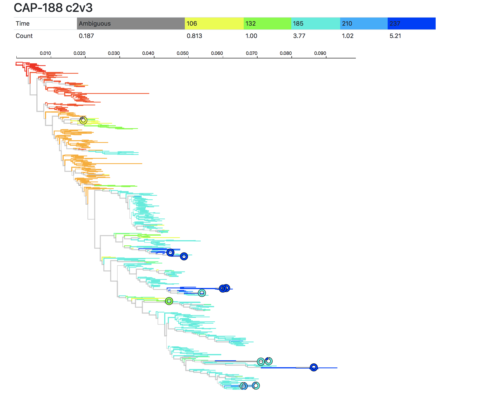

# Phylogenetic placement of QVOA reads

This module visualizes the assignment of post-ART QVOA sequences to pre-ART time points characterized by deep RNA viral sequencing. The end result is a maximum likelihood of all unique RNA reads with QVOA reads, and QVOA trees annotated by the probability of belonging to a particular timepoint using the method of phylogenetic placement (see [this paper](https://www.ncbi.nlm.nih.gov/pubmed/26194754))

The interactive results page is accessible at [https://spond.github.io/misc/qvoa-placement](https://spond.github.io/misc/qvoa-placement)

An example tree is shown below 

---

The tree is annotated by timepoint color (red -- acute, blue -- nearest ART), with internal branches given a color if all of their descendants have the same color. Grey = indeterminate/ambiguous timing. QVOA sequences are labeled with pie-charts, showing the confidence with which they were allocated to specific timepoints. There is also a summary table at the top, indicating the total fraction of reads allocated to any specific timepoint (here the time is in weeks post infection)

In the example plot you can see that 5.2 reads were from 237 wpi, 1.02 from 210 and so on. You can also see that some QVOA reads were very confidently placed (solid pies) while some others had notable uncertainty about placement (multi-colored pies).

### Pipeline details

The pipeline proceeds as follows

### Data curation 

1. Find the reading frame of each sequence; correct frame if necessary using codon-aware alignment. Replace all sequences that are identical with a single representative (speeds up calculations, does not alter phylogenetic inference results).

2. Translate in-frame sequences to amino-acids

3. Align amino-acid sequences using `muscle`

4. Map nucleotide sequences back onto the protein alignment

5. Infer phylogenies using `FastTree2`

6. Perform QVOA phylogenetic placemment using a modified version of `IgSCUEAL` [https://www.ncbi.nlm.nih.gov/pubmed/26194754](https://www.ncbi.nlm.nih.gov/pubmed/26194754)